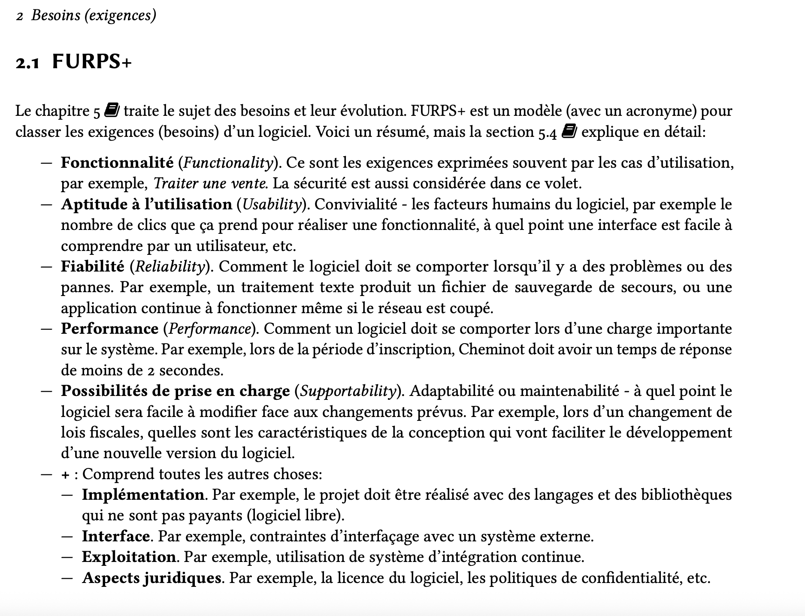

+++
pre = '<b>1.1 </b>'
title = "S.E.L"
weight = 1
+++

# spécifications des exigences logicielles

La **spécification des exigences logicielles** (SEL) décrit **ce que** le système doit faire et **dans quelles conditions** il doit le faire.  
Elle sert de contrat **vérifiable** entre parties prenantes (métier, dev, QA, ops), encadre la **conception** et facilite les **tests d’acceptation**.

> Objectif : transformer un besoin flou en exigences **claires, mesurables et traçables**.

L’image classique du **“tree swing”** illustre les malentendus possibles entre client, analyste, dev et test : chacun imagine une solution différente au même besoin, d’où l’importance d’un **SEL précis**.

## Exigences **fonctionnelles** vs **non fonctionnelles** 
Les exigences non fonctionnelles désignent les attributs de qualité d'un système qui définissent ses performances plutôt que ses fonctions. Contrairement aux exigences fonctionnelles, qui spécifient les actions et les tâches qu'un système doit accomplir, les exigences non fonctionnelles se concentrent sur les caractéristiques globales et le comportement du système dans diverses conditions. Elles abordent des aspects tels que la performance, la convivialité, la fiabilité et l'évolutivité, garantissant ainsi que le système répond aux normes de qualité et offre une expérience utilisateur satisfaisante.

{}

{}
### Fonctionnelles — *le quoi*
Ce que le système **fait** (capacités, règles métier, scénarios).  
Elles décrivent les **comportements observables** du point de vue des utilisateurs/systèmes externes.

#### Catégories courantes & exemples
- **Interactions utilisateur** : s’authentifier, créer un compte, rechercher un item, réserver, payer.
- **Règles métier** : calculer des frais, appliquer des politiques, autoriser/refuser selon conditions.
- **Gestion des données** : créer/lire/mettre à jour/supprimer (CRUD), importer/exporter.
- **Intégrations** : envoyer un courriel/SMS, consommer une API tierce, webhooks.
- **Rapports & tableaux de bord** : statistiques, historiques, export CSV/PDF.
- **Administration** : gestion des rôles, configuration de politiques/paramètres.

#### Niveaux de granularité (pour bien structurer)
- **Épic** → **Feature** → **User Story** → **Tâches**
- Alternative/formalisme : **Cas d’utilisation (Use Case)** pour détailler un scénario clé.

  <input type="radio" name="gran" id="g-epic" checked>
  <input type="radio" name="gran" id="g-feature">
  <input type="radio" name="gran" id="g-story">
  <input type="radio" name="gran" id="g-task">

  

    <label class="pill" for="g-epic">Épic</label>→
    <label class="pill" for="g-feature">Feature</label>→
    <label class="pill" for="g-story">User Story</label>→
    <label class="pill" for="g-task">Tasks</label>
  

  

    

      <h4>Épic</h4>
      
Un <strong>grand objectif métier</strong> couvrant plusieurs itérations (semaines / mois).

      
<em>Ex.</em> « Gérer le cycle complet <strong>réservation → prêt → retour</strong> des équipements. »

    

    

      <h4>Feature</h4>
      
Une <strong>capacité métier cohérente</strong> qui apporte de la valeur <em>en soi</em>.

      
<em>Ex.</em> « <strong>Réservation en ligne</strong> des équipements. »

    

    

      <h4>User Story</h4>
      
Une <strong>petite valeur utilisateur</strong>, livrable en quelques jours, testable via <strong>critères d’acceptation</strong>.

      
<em>Ex.</em> « En tant qu’<strong>étudiant</strong>, je veux <strong>réserver un appareil photo</strong> afin de <strong>le récupérer demain au comptoir</strong>. »

    

    

      <h4>Tâches</h4>
      
Les <strong>actions techniques</strong> pour réaliser une story (dev, tests, doc, UI…).

      
<em>Ex.</em> « Créer endpoint <code>POST /reservations</code> », « Valider conflits de créneau », « Formulaire UI + validations ». 

    

  

#### Formats recommandés
**User Story (+ critères d’acceptation)**  
> En tant que **\<acteur>**, je veux **\<capacité>** afin de **\<valeur>**.  
> **critères d’acceptation** (Given/When/Then) : mesurables, observables.

#### Exemples d'exigences fonctionnelles
- « Au paiement, si un article passe en rupture, le système empêche la commande et propose des alternatives. »
- « Après confirmation, le système envoie un courriel avec le récapitulatif et le numéro de suivi. »
- « Un patient peut prendre rendez-vous avec un praticien en choisissant un créneau disponible. »
- « Le système empêche la double réservation d’un même praticien sur un même créneau. »
- « Le système envoie un rappel 24 h avant le rendez-vous par SMS. »
- « Le système génère un PDF de relevé mensuel accessible dans l’espace client. »
- « L’enseignant peut annoter un PDF remis et publier une note avec commentaires. »
- « L’utilisateur peut sélectionner des sièges numérotés ; le système bloque les sièges 10 minutes pendant le paiement. »
  
{}

{}
### Non fonctionnelles — *le comment/qualités*
Il s'agit des qualités **mesurables** du système et contraintes globales. Elles sont généralement définies par :
- **Performance**: décrit la vitesse à laquelle le système doit fonctionner dans des conditions normales et de pointe, telles que les temps de chargement des pages ou la vitesse de traitement.
- **Évolutivité**: garantit que le système peut gérer la croissance de la demande des utilisateurs ou du volume de données sans perte de performances significative.
- **Convivialité**: l’objectif est de rendre le système intuitif et convivial, en améliorant l’expérience utilisateur grâce à la conception et à l’accessibilité.
- **Fiabilité**: garantit que le système fonctionne de manière cohérente et est disponible en cas de besoin, y compris la disponibilité du système et la tolérance aux erreurs.
- **Sécurité**: spécifie les normes de sécurité, telles que le cryptage des données, les contrôles d'accès et les mesures visant à empêcher l'accès non autorisé ou les violations de données.

#### Exemples d'exigences non fonctionnelles
- **Performance & latence** : p95 < 1,5 s ; p99 < 2,5 s ; ≥ 500 req/s soutenues.
- **Disponibilité & fiabilité** : disponibilité 99,5 %/mois ; MTTR < 30 min ; RTO 30 min / RPO 5 min.
- **Scalabilité & capacité** : tenir 3× la charge nominale par ajout d’instances ; files d’attente < 1 000 msgs.
- **Sécurité** : 2FA pour admin ; chiffrement TLS 1.3 en transit, AES-256 au repos ; correctifs critiques < 7 j.
- **Résilience / tolérance aux pannes** : retries avec backoff ; circuit breaker ; dégradation gracieuse documentée.
- **Maintenabilité & déployabilité** : couverture tests ≥ 80 % ; déploiement < 15 min ; complexité cyclomatique moyenne < 10.
- **Observabilité** : logs structurés (JSON) ; traces distribuées ; 10 métriques clés exposées (latence, erreurs, saturation…).
- **Compatibilité / portabilité** : navigateurs N-2 ; images Docker multi-arch ; OS supportés listés.
- **UX & accessibilité** : conformité WCAG 2.1 AA ; tâche clé en ≤ 3 clics ; focus visible clavier.
- **Conformité & données** : RGPD ; rétention 365 jours ; anonymisation des PII dans les logs.
- **Interopérabilité / API** : contrat OpenAPI versionné ; compat ascendante sur deux versions.
- **Coût / efficience** : coût cloud mensuel ≤ 1 200 $ pour l’environnement prod.
  
#### Comment bien formuler une exigence non fonctionnelle
Structure utile : **[Contexte] + [Métrique] + [Seuil] + [Période/Population] + [Méthode de mesure]**.
> Toujours **quantifier** (+ contexte de test).
  
**Exemple (phrase complète)**  
Lors d’une recherche sur le catalogue de 10 000 articles **aux heures de pointe**, le **95ᵉ percentile** de la **latence serveur** doit être **< 1,5 seconde** **sur une fenêtre glissante de 7 jours**, **mesuré par Prometheus** sur l’endpoint `/search`.

**Autre exemple**
- Vitesse de performance : le système doit traiter les demandes des utilisateurs dans un délai moyen de 2 secondes, même en cas de trafic utilisateur élevé.
- Disponibilité du système : le système doit maintenir une disponibilité de 99.9 % pour garantir aux utilisateurs un accès cohérent.
- Normes de sécurité : le système doit utiliser un cryptage 256 bits pour le stockage des données et se conformer aux réglementations en vigueur en matière de protection des données.

#### Qualité d’une exigence (checklist rapide)
- **Claire** (univoque), **nécessaire**, **testable**, **priorisée**, **traçable**.  
- Éviter les termes vagues : remplacer “rapide”, “sécurisé” par des **seuils mesurables**.  
- 1 exigence = 1 idée ; critères d’acceptation **observables**.
{}

{}

## Les cmposantes principales d’un **SEL**
1. **Méta & version** — titre, auteur·e·s, version, historique des changements. 
2. **Glossaire** — termes métier et acronymes.  
3. **Vision & contexte** — problème, objectifs, parties prenantes.  
4. **Portée (scope)** — **In/Out** + hypothèses et risques majeurs.  
5. **Exigences fonctionnelles** — épics, **user stories** ou **cas d’utilisation** + **critères d’acceptation**.  
6. **Exigences non fonctionnelles** — qualités **mesurées** (perf, sécu, disponibilité, etc.).  
7. **Vues/Modèles** — *Use Case Diagram*, aperçu **UML** (classes/séquence) au besoin.  
8. **Données & interfaces** — objets métier clés, **contrats API** (OpenAPI/GraphQL), formats d’échange.  
9.  **Contraintes & dépendances** — techno imposée, navigateurs cibles, normes, intégrations.  
10. **Traçabilité** — matrice **Exigence ↔ UC/Story ↔ Test d’acceptation**.  

{}
**Lecture guidée en classe — exemple de SEL**  
Nous analyserons ce rapport pour la structure d’un SEL, la formulation F/NF et la traçabilité.  
**Lien** : http://www.info2.uqam.ca/~makarenkov_v/INM5151/sel_ete2015/SEL_Les_AS_Rapport.pdf
{}

<!--  -->

<!-- Exemples TP -->
<!-- « Le membre peut rechercher des équipements par catégorie, mot-clé et disponibilité sur une plage de dates. »

« Le système doit empêcher la double réservation du même équipement sur des créneaux qui se chevauchent. »

« Lors de la confirmation, le système enregistre la réservation avec le statut “Confirmée” et notifie l’utilisateur par courriel. »

« Un employé peut mettre un équipement en maintenance, ce qui le retire automatiquement des créneaux réservables. »

« Un membre peut prolonger un prêt une fois, uniquement si aucune réservation n’existe pour la période suivante. » -->

<!-- Exemple complet (Bibliothèque d’Objets)
Chaîne Épic → Feature → Stories → Tâches
Épic : Cycle Réservation–Prêt–Retour

Feature : Réservation en ligne

Story 1
En tant que membre
je veux chercher un équipement disponible et réserver un créneau
afin de garantir sa disponibilité au comptoir.
Critères d’acceptation (Given/When/Then)

Given un appareil “Caméra A” disponible demain 9–12h
When je sélectionne ce créneau et confirme
Then une réservation avec référence est créée et un courriel de confirmation est envoyé.

Given une collision de créneau
When je tente de réserver
Then le système refuse et propose les créneaux libres adjacents.
Tâches (exemples)

Modèle Reservation (statuts, dates).

API GET /equipements?dispo=…, POST /reservations.

Vérif de conflit côté service + test unitaire.

Page “Résultats + sélection créneau” (UI) + validations.

Story 2 : Prolonger une réservation si aucun conflit.

Story 3 : Annuler une réservation (avant l’échéance).

Feature : Notifications

Story : Courriel de rappel 24 h avant l’échéance (fallback SMS plus tard).

Feature : Gestion des pénalités

Story : Bloquer la création de nouvelles réservations en cas de retard actif.

Variante en Use Case (même besoin)
UC : Réserver un équipement
Acteur principal : Membre
Préconditions : Membre authentifié, équipement existant.
Scénario nominal :

Le membre recherche un type d’équipement.

Le système affiche les créneaux disponibles.

Le membre choisit un créneau et confirme.

Le système crée la réservation, envoie la confirmation.
Alternatif : créneau plus disponible → proposer alternatives.
Exception : quota atteint → refuser avec message explicite.
Postconditions : réservation “Confirmée”, événement de notification planifié. -->